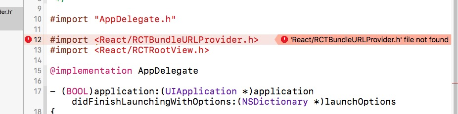

# React Native V0.45.0-rc
> 版本号：0.42 
> 开始日期：2016.10.10 

#### 微信公众号：Domeday

> MacBook Pro: [无法 加入‘xx’wifi](https://www.zhihu.com/question/20026105) 

> [wechat,qq,sina 登录/分享组件](https://github.com/reactnativecn)

> [React Native开发错误警告总结（持续更新）](http://www.jianshu.com/p/98c8f2a970eb)

> [react native打包后image无法显示，debug下却可以->解决方案 ](https://my.oschina.net/u/1460994/blog/802181)

> [react native 博客之星-刘成](http://my.csdn.net/liu__520)

> [良心 Marno](http://www.marno.cn/)

> [React/React Native 的ES5 ES6写法对照表](http://reactnative.cn/post/15)

> [Touch Android](https://github.com/jariz/react-native-fingerprint-android)

> [Touch IOS](https://github.com/naoufal/react-native-touch-id)

> [50 个完整的 React Native](https://juejin.im/post/58f37cb361ff4b0058f9824a)

> [30天，每天以案例](https://github.com/fangwei716/30-days-of-react-native)

#### react-native指定版本：	
	react-native init Name --version=0.42

> get 详细版本信息指定方式：
	[指定版本>>](http://www.jianshu.com/p/646c5fbd9659 "指定版本")

## 项目过程中遇到的 RN 初级问题记录区

#### React Native平台适配:
	1.Android中图片放在android\app\src\main\res下(文件夹名:drawable-xxhdpi),并且图片名都是小写
	2.Ios中进入ios\MobileCampus\下,删除Images.xcassets文件夹下的东西,复制你的图片
#### 使用Navigator跳转下一页时的切换特效:
切换时body需要设置backgroundColor/flex,没有backgroundColor/flex时切换时可以看见切换前的页面渐隐效果,体验不好

	例如:View style={{flex:1,backgroundColor:'#fff'}}
	
#### react native USB真机调试报错
##### error:
>FAILURE: Build failed with an exception. 
What went wrong: 
 Execution failed for task ' : app:installDebug'. 
 com.android.builder.testing.api.DeviceException: com.android.ddmlib.InstallException: Unable to upload some APKs

解决方法: [USB调试真机调试>>](http://csbun.github.io/blog/2015/12/starting-react-native-with-android/)

#### 解决安卓多个真机调试报错问题:
	Debug模式多台真机调试,没换一次手机,都需要给手机重新下载配置文件

#### React Native Reload不更新
	解决方案:
	例如:E:\Study\node_modules\react-native\packager\react-packager\src\node-haste\FileWatcher\index.js
找到并更改为:
<pre>
const MAX_WAIT_TIME = 360000;

_createWatcher(rootConfig) {
    const watcher = new WatcherClass(rootConfig.dir, {
      glob: rootConfig.globs,
      dot: false,
    });
    return new Promise((resolve, reject) => {
      const rejectTimeout = setTimeout(
        () => reject(new Error([
            'Watcher took too long to load',
            'Try running `watchman version` from your terminal',
            'https://facebook.github.io/watchman/docs/troubleshooting.html',
          ].join('\n'))),
        MAX_WAIT_TIME
      );
      watcher.once('ready', () => {
        clearTimeout(rejectTimeout);
        resolve(watcher);
      });
    });
  }
</pre> 
#### listView组件更新机制:[Github](https://github.com/changfuguo/react-native/blob/master/listview.md);
#### ListView不滑动问题
	解决方法：listview自身和它的父容器都要加flex：1,哪层断了都不行

	相关解决方法:[stackoverflow](http://stackoverflow.com/questions/32874559/listview-fails-to-scroll);

#### JPush-react-native:极光推送
> 测试时推送建议消息：建议集成SDK时加上统计代码以评估推送效果;
  
##### 解决方式按照提示内容找到

>X:xxx porject\node_modules\react-native\local-cli\link\__fixtures__\android\0.17\下的MainActivity.java文件，
搜索onPesume()，在此方法中加入:JPushInterface.onResume();就不会推送显示此消息,

>X:xxx porject\node_modules\react-native\local-cli\link\__fixtures__\android\0.17\下的每一个.java文件，
搜索onPesume()/onPause方法，在此方法中加入:JPushInterface.onResume();/JPushInterface.onPause()就不会推送显示此消息,

#### JPush-react-native:react-native run-android报错：Unknown named module: jpush-react-native'
	rnpm link jpush-react-native 导入模块时出了问题
	
>相关issue提问：[@jpush-react-native:107](https://github.com/jpush/jpush-react-native/issues/107)

#### React Native开发中遇到的问题总结
> 1.在操控Genymotion时,鼠标左右滑动会切换到自动搜索,搜索框中自动输入0003,这问题搞得我当时很头痛,最后发现是因为开启的有道词典的划词取词导致这样,关闭有道或者取消划词取词功能;

> 2.使用Navigator跳转下一页时的切换特效:
	切换时body需要设置backgroundColor/flex,没有backgroundColor/flex时切换时可以看见切换前的页面渐隐效果,体验不好
	例如:View style={{flex:1,backgroundColor:'#fff'}}

> 3.安卓禁止禁止横屏：..\android\app\src\main\AndroidManifest.xml添加：
	找到android:name=".MainActivity"
		添加属性：
		 android:screenOrientation="portrait"

> 4.Android中图片放在android\app\src\main\res下(文件夹名:drawable-xxhdpi),并且图片名都是小写
Ios中进入ios\MobileCampus\下,删除Images.xcassets文件夹下的东西,复制你的图片

#### Ubuntu 权限问题

这是gradlew没有执行权限
>解决方案：chmod +x ./android/gradlew

- 每个项目都得执行一次吗？

	只有一个原因需要执行，就是你这个项目是别处拷来的

#### 安装成功之后，打开报这个错

